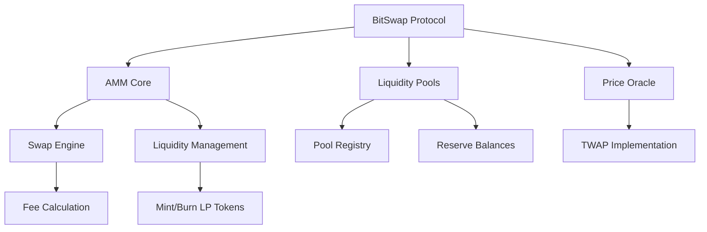

# BitSwap Protocol

[](https://opensource.org/licenses/MIT)


**BitSwap** is a Bitcoin-native automated market maker (AMM) protocol built on the **Stacks Layer 2**, enabling decentralized, trustless trading of Bitcoin and Stacks assets through efficient, low-slippage liquidity pools. It leverages the classic `x * y = k` constant product formula and is implemented using Clarity smart contracts.

## 📜 Table of Contents

* [Features](#features)
* [Architecture Overview](#architecture-overview)
* [Core Concepts](#core-concepts)
* [Usage](#usage)
* [Admin Functions](#admin-functions)
* [Constants & Error Codes](#constants--error-codes)
* [Security Considerations](#security-considerations)
* [License](#license)

## 🚀 Features

* Constant product AMM model (`x * y = k`)
* Capital-efficient liquidity provision
* Non-custodial and trustless operation
* Adjustable protocol fee (default: 0.3%)
* Slippage protection for users and LPs
* Admin-controlled circuit breakers
* TWAP oracle support and analytics

## 🏗️ Architecture Overview

### System Components



### High-Level Interaction

```
+------------------+         +------------------+
|  Liquidity Pools | <-----> | Fungible Tokens  |
+------------------+         +------------------+
         ↑                            ↑
         |                            |
         v                            v
+------------------+         +------------------+
| Liquidity Provider|        |  Traders/Swappers |
+------------------+         +------------------+
         ↑                            ↑
         |                            |
         +------------+---------------+
                      |
                      v
            +---------------------+
            |     BitSwap AMM     |
            |  (Clarity Contract) |
            +---------------------+
```

---

## 🧠 Core Concepts

### Pool Structure

* Dual-token reserves (`x` and `y`)
* LP tokens track ownership proportionally
* Pool states: active/inactive
* Reserves and fee accumulation per pool

### Swap Mechanics

* Constant product formula: `x * y = k`
* Fee-adjusted swap output:

  ```clarity
  output = (input * fee_adjusted * output_reserve) /
           (input_reserve * precision + input * fee_adjusted)
  ```

### Fee Structure

* Default: `0.3%` (adjustable by admin)
* Accumulated into pool reserves
* 6-decimal precision (1e6)

## ⚙️ Usage

### ✅ Create Pool

```clarity
(contract-call? .bitswap-core create-pool token-x token-y)
```

* Tokens must be different
* Owner-only call

### 💧 Add Liquidity

```clarity
(contract-call? .bitswap-core add-liquidity
  pool-id token-x token-y amount-x amount-y min-shares)
```

* LP shares minted proportionally
* Slippage-safe via `min-shares`

### 🔁 Swap Tokens

```clarity
(contract-call? .bitswap-core swap-exact-tokens
  pool-id input-token output-token input-amount min-output x-to-y?)
```

* Follows constant product curve
* Slippage protection via `min-output`

### 🧻 Remove Liquidity

```clarity
(contract-call? .bitswap-core remove-liquidity
  pool-id token-x token-y shares min-amount-x min-amount-y)
```

* Burns LP tokens
* Returns proportion of reserves

## 🔐 Admin Functions

| Function           | Purpose                              |
| ------------------ | ------------------------------------ |
| `set-protocol-fee` | Adjusts global protocol fee          |
| `pause-pool`       | Disables swaps and liquidity changes |
| `resume-pool`      | Re-enables paused pool               |

## 🧾 Constants & Error Codes

| Constant            | Description            |
| ------------------- | ---------------------- |
| `PRECISION`         | 1,000,000 (6 decimals) |
| `protocol-fee-rate` | 3000 (0.3%) default    |

| Error Code              | Description                       |
| ----------------------- | --------------------------------- |
| `ERR-NOT-AUTHORIZED`    | 100 – Unauthorized call           |
| `ERR-INVALID-AMOUNT`    | 101 – Invalid token amount        |
| `ERR-POOL-NOT-FOUND`    | 103 – Pool does not exist         |
| `ERR-SLIPPAGE-TOO-HIGH` | 105 – Fails min. amount condition |

## 🛡️ Security Considerations

* **Access Control**: Restricted admin ops
* **Precision-Safe Math**: Integer-based arithmetic with 6 decimal precision
* **Slippage Checks**: Protection against MEV and price manipulation
* **Pause Controls**: Emergency stop for pools
* **Stacks + Bitcoin Finality**: Secure execution model

> 🔍 **Audit Status**: *Pending third-party audit — NOT mainnet ready.*

## 📚 References

* [Stacks Docs](https://docs.stacks.co/)
* [Clarity Language](https://clarity-lang.org/)
* [Uniswap Whitepaper](https://uniswap.org/whitepaper.pdf)
